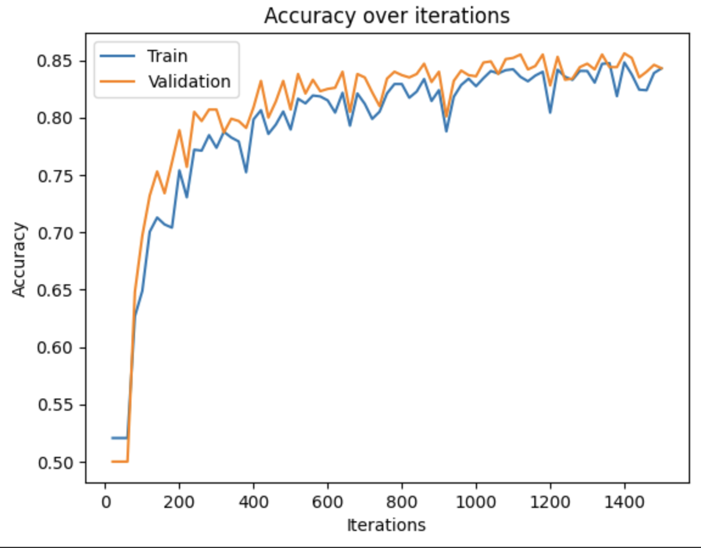

# Interactive Melanoma Classifier (Demo [here](https://melanomas.streamlit.app))
This is a classifier based on a CNN model that I wrote myself, achieves around 80-85% accuracy on the 
following [dataset](https://www.kaggle.com/datasets/hasnainjaved/melanoma-skin-cancer-dataset-of-10000-images/data).

The entire training process (epoch #, batch sizes, etc) can be seen inside the .ipynb file in the training folder, and the model architecture+my trained weights are in ```model```. Feel free to look around.

IMPORTANT: Imports are messing with Streamlit so the model is decoupled from the frontend atm, working on a fix.
In the meantime, here are the Training and Validation/Testing accuracies on the dataset:



