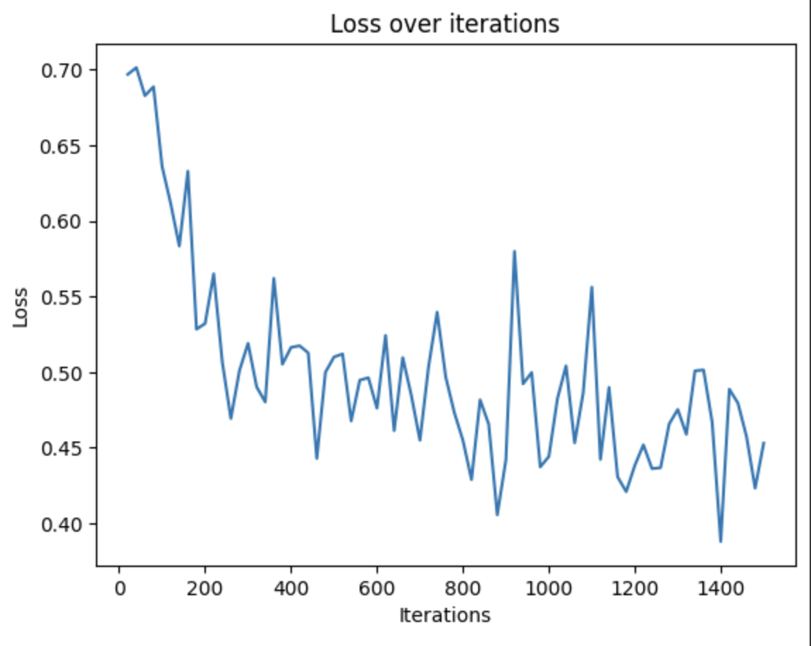
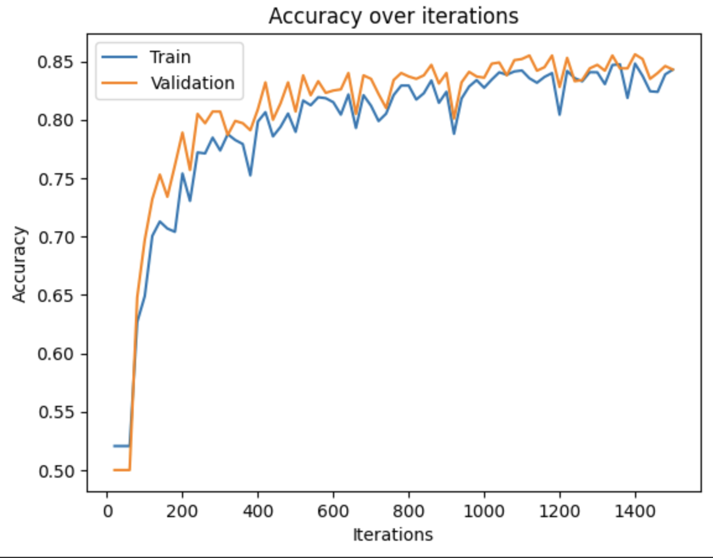

# Interactive Melanoma Classifier (Demo [here](https://melanomas.streamlit.app))
Imports are messing with Streamlit so the model is decoupled from the frontend atm, working on a fix.
In the meantime, here are the Training and Validation/Testing accuracies on the dataset:

# About
This is a classifier based on a CNN model that I wrote myself. 

